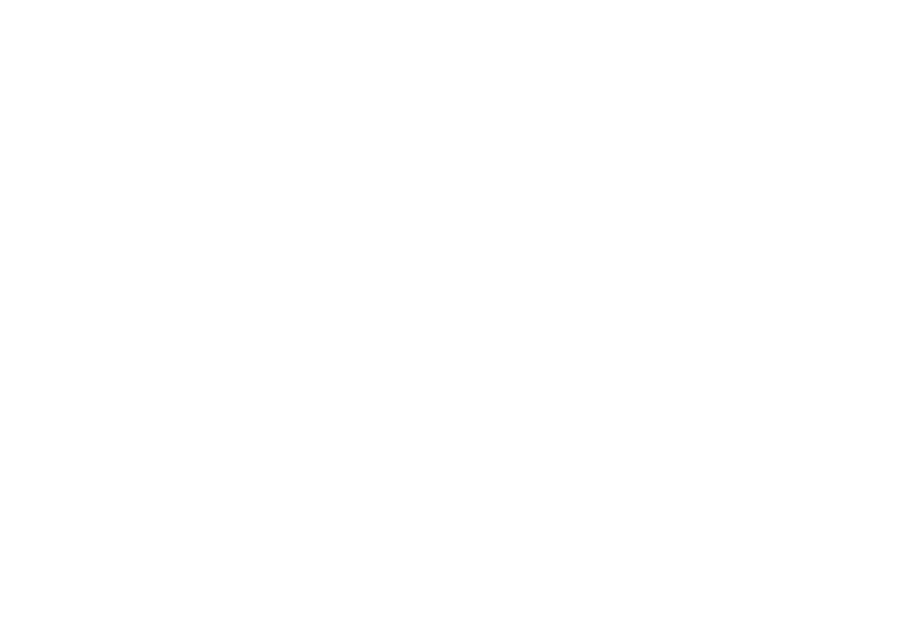

# 2024-NPA-PO-Hackstone
Hackstone est un jeu de carte tour à tour jouable en joueur contre ordimateur ou en joueur contre joueur.

Ce jeu, inspiré de Yu-Gi-Oh ainsi que de Hearthstone (pour le design et en partie pour le gameplay) reprend les bases de la sécurité informatique de façon ludique.

Il se fait confronter un administrateur système face à un hacker.
L'administrateur système à pour objectif de protéger son environnement informatique des attaques du hacker.

Le hacker doit quant à lui réussir à réduire les pour de vie du système à 0 avant la fin du temps imparti. 

L'adminstrateur a 5 PV.

Le hacker 5 minutes de temps d'attaque.

# Plateau de jeu 

La case informations sur une cartes permet de poser une cartes de jeu dessus et d'afficher une page à l'écran faisant une courte description de la carte posée.

# Règles 
* Les cartes d'attaque doivent attendre un tour après avoir été posées avant de pouvoir attaquer.
* Lors d'une attaque la carte attaquante doit obligatoirement attaquer la cartes qui la défend si elle est présente sur le terrain de l'adversaire, sinon elle peut attaquer les PV du défenseur.
* Lorsqu'on attaque les points de vie du défenseur on lui en retire un seul quelque soit la carte.
* L'anonymus doit obligatoirement attaquer les cartes en défense quelqu'elle soit, il peut résister à deux attaques et attaquer deux fois par tour.
* Si au début de son tour un joueur à 6 cartes dans sa main il doit au lieu de piocher, prendre la cartes du dessus de son deck et la mettre au cimetière.
* La quatrième zone de de cartes est utilisable uniquement par le défenseur lorsqu'il à utiliser la carte stockage pour la débloquer.

# Déroulement d'une partie 
* Premier tour : 
  - Lors du lancement du jeu, nous choisissons notre rôle (attaquant ou défenseur), chaque rôle possède son propre deck de cartes.
  - Au début de la partie chaque joueur pioche 5 cartes
  - L'attaquant commence.
  - Les cartes posées par l'attaquant ne peuvent pas attaquer au tour ou elles ont été posé, elles doivent attendre au minimum un tour de repos.
  - Une fois que l'attaquant a terminé son tour, c'est au défenseur de jouer.
  - Il pioche une 6ème carte.
  - Le défenseur doit ensuite poser ses cartes selon celle de l'adversaire afin de pouvoir se protéger des ses attaques.
    
* Reste de la partie :
  - Lors du début de son tour le joueur quelque soit son rôle pioche jusqu'à avoir 5 cartes dans sa main. 
  - L'attaquant peut désormais attaquer avec les cartes qu'il a poser au premier tour.
  - Lorsqu'une carte attaque elle doit **obligatoirement** attaquer la carte qui la défend si il y en a une présente sur le terrain du défenseur. Sinon, elle peut attaquer directement les points de vie du défenseur.
  - Lorsqu'une carte à attaquer une carte qui la défend les deux cartes s'étant confrontées se détruise.
  - L'attaquant remporte la partie lorsque le défenseur n'a plus de points de vie, et le défenseur gagne lorsque l'attaquant n'a plus de temps pour attaquer.

# Cartes 
* Le deck du défenseur possède 18 cartes qui sont :
  - 3 Antivirus
  - 2 Chiffrements de données
  - 2 Firewall
  - 2 Mise à jour
  - 2 Authentification à deux facteurs
  - 3 Backup
  - 2 VPN
  - 1 Stockage
  - 1 Super-antivirus
 
* Le deck de l'attaquant en possède 23
  - 2 Virus
  - 2 Cheval de Troie
  - 3 DDOS
  - 3 Logiciel malveillant
  - 3 Hacker
  - 2 Panne réseau
  - 2 Elévation de privilège
  - 3 Brutforcing
  - 2 Phishing (jouable uniquement par l'ordinateur)
  - 1 Anonymus

* Rapport entre les cartes
   - Les antivirus défendent les virus et les chevaux de Troie
   - Les chiffrements de données défendent les élévations de privilèges
   - Les firewall défendent les DDOS
   - Les mises à jour défendent les logiciels malveillants
   - Les authentification à deux facteurs défendent les brutforcings
   - Les backup défendent les pannes réseau
   - Les VPN défendent les hacker
   - Le super-antivirus défend l'anonymus
  
 
* Capacités spéciales
   - Le stockage permet de débloquer une case de plus pour poser une carte supplémentaire en défense
   - L'anonymus détruit toute les cartes poser sur les deux terrains lors de son invocation
   - Le super-antivirus permet de protéger les cartes en défense lors de l'invocation de l'anonymus et permet aussi de résister à deux attaques de virus ou de cheval de Troie
