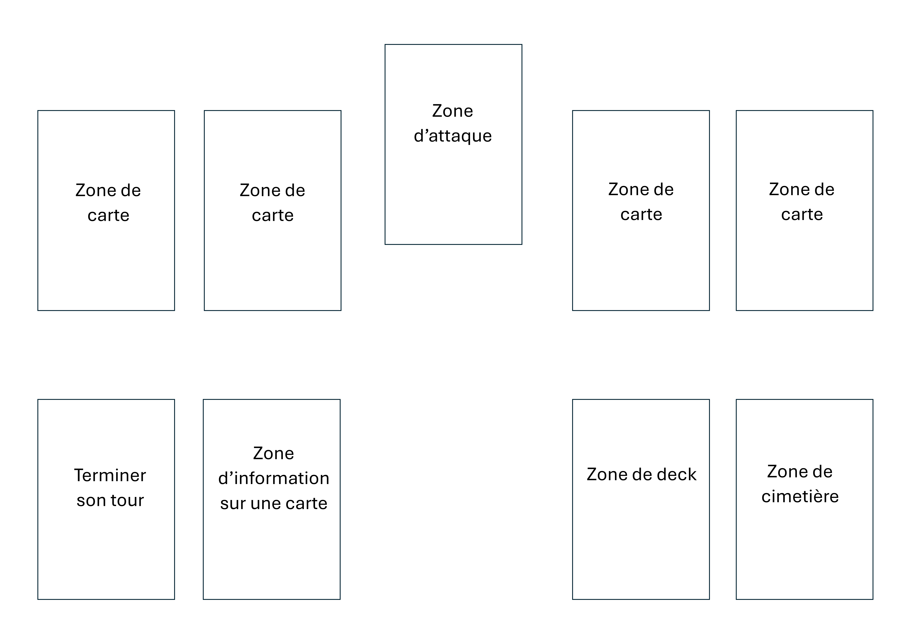

# 2024-NPA-PO-Hackstone

Hackstone est un jeu de cartes tour à tour jouable en joueur contre ordinateur ou en joueur contre joueur.

Ce jeu, inspiré de Yu-Gi-Oh ainsi que de Hearthstone (pour le design et en partie pour le gameplay), reprend les bases de la sécurité informatique de façon ludique.

Il fait se confronter un administrateur système face à un hacker.
L'administrateur système a pour objectif de protéger son environnement informatique des attaques du hacker.

Le hacker doit quant à lui réussir à réduire les points de vie du système à 0 avant la fin du nombre de tours imparti. 

L'administrateur a 5 PV.

Le hacker a jusqu'à la fin de son 5ème tour pour réduire les points de vie de l'administrateur à zéro.

# Plateau de jeu 

La zone d'informations sur une carte permet de poser une carte de jeu dessus et d'afficher une page à l'écran faisant une courte description de la carte posée.

# Règles 
* Les cartes d'attaque doivent attendre un tour après avoir été posées avant de pouvoir attaquer.
* Lors d'une attaque, la carte attaquante doit obligatoirement attaquer la carte qui la défend si elle est présente sur le terrain de l'adversaire, sinon elle peut attaquer les PV du défenseur.
* Lorsqu'on attaque les points de vie du défenseur, on lui en retire un seul quelque soit la carte.
* L'anonymus doit obligatoirement attaquer les cartes en défense quelle qu'elles soient, il peut résister à deux attaques et attaquer deux fois par tour.
* Lorsqu'un super-antivirus ou un white hat est posé en défense, les cartes doivent les détruirse avant de pouvoir attaquer les points de vie de l'adversaire, cependant si la carte qui défend spécifiquement la carte attaquante est posée (si l'on essaie d'attaquer avec un DDOS et qu'un Firewall est posé en défense), la carte doit l'attaquer avant le super-antivirus ou le white hat.
* Si à la fin de son tour un joueur à 7 cartes dans sa main, il doit en mettre une au cimetière.
* La quatrième zone de cartes est utilisable uniquement par le défenseur lorsqu'il a utilisé la carte stockage pour la débloquer.
* Le nombre de tour de l'attaquant augmente au début de son tour.

# Déroulement d'une partie 
* Premier tour : 
  - Lors du lancement du jeu, nous choisissons notre rôle (attaquant ou défenseur), chaque rôle possède son propre deck de cartes.
  - Au début de la partie, chaque joueur pioche 5 cartes.
  - L'attaquant commence.
  - Les cartes posées par l'attaquant ne peuvent pas attaquer au tour où elles ont été posées, elles doivent attendre au minimum un tour de repos.
  - Une fois que l'attaquant a terminé son tour, c'est au défenseur de jouer.
  - Il pioche une 6ème carte.
  - Le défenseur doit ensuite poser ses cartes selon celles de l'adversaire afin de pouvoir se protéger des ses attaques.
    
* Reste de la partie :
  - Lors du début de son tour, le joueur, quel que soit son rôle, pioche jusqu'à avoir 5 cartes dans sa main. 
  - L'attaquant peut désormais attaquer avec les cartes qu'il a posées au premier tour.
  - Lorsqu'une carte attaque, elle doit **obligatoirement** attaquer la carte qui la défend si il y en a une présente sur le terrain du défenseur. Sinon, elle peut attaquer directement les points de vie du défenseur.
  - Lorsqu'une carte a attaqué une carte qui la défend, les deux cartes s'étant confrontées se détruisent.
  - L'attaquant remporte la partie lorsque le défenseur n'a plus de points de vie, et le défenseur gagne lorsque l'attaquant est arrivé au terme de son cinquième tour.

# Cartes 
* Le deck du défenseur possède 21 cartes qui sont :
  - 3 Antivirus
  - 2 Chiffrements de données
  - 2 Firewall
  - 2 Mises à jour
  - 2 Authentification à deux facteurs
  - 2 Backup
  - 2 VPN
  - 2 White hat
  - 2 Redondance de données 
  - 1 Stockage
  - 1 Super-antivirus
 
* Le deck de l'attaquant en possède 25 :
  - 2 Virus
  - 2 Cheval de Troie
  - 3 DDOS
  - 3 Logiciels malveillants
  - 3 Hacker
  - 3 Pannes réseau
  - 3 Elévations de privilège
  - 3 Bruteforcing
  - 2 Phishing (jouable uniquement par l'ordinateur)
  - 1 Anonymus

* Rapport entre les cartes :
   - Les antivirus défendent les virus et les chevaux de Troie.
   - Les chiffrements de données défendent les élévations de privilèges.
   - Les firewall défendent les DDOS.
   - Les mises à jour défendent les logiciels malveillants.
   - Les authentifications à deux facteurs défendent les bruteforcing.
   - Les backup défendent les pannes réseau.
   - Les VPN défendent les hackers.
   - Les White hat peuvent défendre une attaque de n'importe quelle carte.
 
* Capacités spéciales
   - Le stockage permet de débloquer une zone de carte de plus pour ajouter une défense supplémentaire.
   - L'anonymous détruit toute les cartes poser sur les deux terrains lors de son invocation.
   - Le super-antivirus n'est pas détruit lors de l'invocation de l'anonymous et permet aussi de résister à deux attaques de n'importe quelle carte excepté l'anonymous.
   - Les redondances de données permettent de copier n'importe quelle carte déjà posée sur le terrain.
